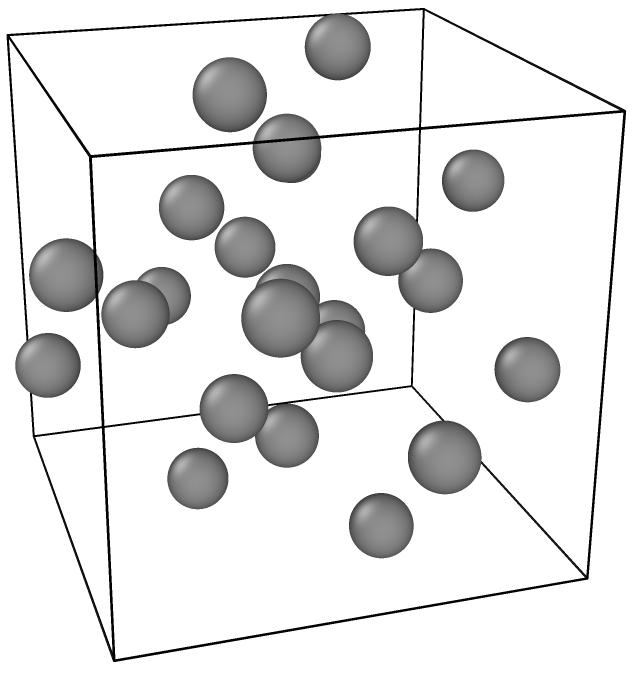

# graph-diffusion-project
This repository contains the code for a project outside course scope titled "Conditional distribution modelling of mono-metal oxides using diffusion models" written by Thomas Christensen and Rasmus Pallisgaard in 2023.

## Overall goal of project
This project aimed at taking first steps towards using diffusion models to generate the class of mono-metalic structures that could produce a given pair distribution function (PDF). Different methods of approaching the overall problem was demonstrated with varying success, and reccomendations for producing a full solution to the problem ended up being the biggest contribution this project provided.

## Structure of repositry
This repository contains 2 simulated datasets.
* `graphs_h5` contains a collection of simulated mono-metalic structures of varying sizes.
* `graphs_fixed_num_135` contains a collection of simulated mono-metalic strucures with 135 atoms, and more simulated variations than `graph_h5`.

The project report can be found in `Graph_project_report.pdf`

Finally the code for the project can be found in the folder `code`

## Diffusion and model classes
Since this project was exploratory over different modelings of nanostructures, the noising and diffusion are seperated into two different classes. Moreover, the models contains the transformations from a standard data format into the case specific ones, as well as the inverse.
